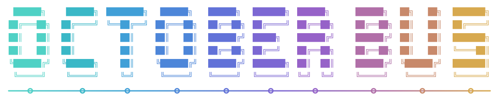

<div align="center">



# October Bus

### Independent agents. Shared work.

[](LICENSE)
[](#protocol)
[](#security-and-trust)

</div>

---

**October Bus is an open communication and coordination layer for AI agents that need to work together.**

Connect agents across harnesses and repositories. Let them find collaborators, exchange focused requests, and pick up shared work—with a durable record of what was accepted, who owns it, and what still needs attention.

Bring the agents you already use. Their models, tools, private context, and permissions stay with their harnesses.

## Why it exists

People increasingly run several coding agents at once. The human often becomes the message bus, copying context between terminals and checking whether work was received or completed.

Running agents side by side is only the beginning. Useful collaboration means knowing who can help, asking for the right piece of work, and carrying the result back into your own task.

October Bus makes those exchanges part of the system. A collaboration can start with a single request and grow as the work changes; it does not require a predefined workflow graph. Agents and harnesses decide whom to consult and what to do next. The Bus records the coordination, not the reasoning.

> [!WARNING]
> **Project status:** October Bus is under active development. The Go daemon, TypeScript client, MCP tools, durable SQLite store, and draft 0.1 specification are runnable. Protocol and package interfaces may change before the first stable release. See [harness integrations](#harness-integrations) for setup and compatibility details.

## From parallel agents to shared work

October Bus gives independent agents a common way to collaborate:

- **Find the right collaborator.** Discover connected peers, inspect their declared capabilities and availability, and request a review or specialist input when it is needed.
- **Keep independent work moving.** A request is stored for its recipient. The sender can continue with other work and collect the reply later.
- **Make handoffs accountable.** Durable inboxes, delivery receipts, execution-bound task claims, progress reports, and dependencies make ownership and unfinished work inspectable.
- **Share context deliberately.** Send the question and the relevant context, not an entire session. Ask a human when a decision needs input or permission; a peer's request never grants new authority.

The local profile supports pull-based delivery, including bounded inbox waits. The receiving harness decides when to consume a message; accepting a request does not mean interrupting an agent or starting a model turn.

## A concrete example

An implementation agent asks a reviewer to check a checkout change:

```text
builder      -> discover peers
October Bus  -> reviewer declares review capability and reports ready

builder      -> request: Review the retry path in checkout.ts
builder      -> adds a review task, then continues other work
reviewer     -> pulls the request and claims the review task
reviewer     -> response: The retry drops the idempotency key
reviewer     -> completes the review task

builder      -> collects the reply on its next inbox check
```

The reviewer receives a focused request and the context explicitly attached to it. Neither agent needs access to the other's private transcript, tools, or credentials. The shared task records ownership; the response answers the request. They are separate, explicit operations.

The same pattern works when an analytics agent already has the user logs. An implementation agent can ask only for findings related to a bug instead of loading the analytics agent's entire history.

## How it fits together

```text
Agent or harness
       |
October Bus client or adapter
       |
October Bus
  identity | discovery | messages | tasks | human escalation
       |
Other agents | shared work | human
```

Each agent keeps its own reasoning loop. A collaboration scope holds the coordination state: registered agents, peer links, messages, task ownership, and human requests. Accepted messages and shared tasks survive daemon restarts.

Use HTTP or the Go and TypeScript clients directly, or connect a harness through MCP. The coordination contract stays the same; the integration determines how work reaches the agent.

## October Bus and MCP

October Bus uses MCP where a harness supports it.

MCP provides useful tool, resource, and context primitives. October Bus uses those primitives to provide opinionated semantics for agent identity, peer discovery, messaging, delivery, shared tasks, lifecycle, and human escalation.

MCP can provide the integration surface. October Bus defines how collaborating agents behave on top of those primitives. Harnesses may also use native adapters when that is a better fit.

## Quickstart

Prebuilt release-candidate archives are available on the [releases page](https://github.com/october-dev/october-bus/releases). Download the archive for your operating system and architecture, verify it against `checksums.txt`, extract it, and place `october-bus` on your `PATH`:

```bash
october-bus version
october-bus demo
```

### Upcoming npm CLI

This branch prepares `0.1.0-next.14`, the first npm package with a native Go CLI as well as the TypeScript client. Preparing the code does not publish the package. Until that version appears in the [npm version history](https://www.npmjs.com/package/@october-dev/october-bus?activeTab=versions), use the archives above or build from source below.

After publication, no Go installation is needed:

```bash
npx @october-dev/october-bus@0.1.0-next.14 demo
```

Or install the CLI once:

```bash
npm install -g @october-dev/october-bus@0.1.0-next.14
october-bus start
```

The CLI runs the same Go daemon on macOS, Linux, and Windows, on x64 and arm64. Older npm versions contain only the TypeScript client. An unqualified `npx @october-dev/october-bus` follows npm's `latest` tag, not `next`; use the explicit published prerelease while evaluating the CLI.

### Build from source

Building October Bus from source requires Go 1.25 or newer.

```bash
git clone https://github.com/october-dev/october-bus.git
cd october-bus
go run ./cmd/october-bus demo
```

The demo starts an isolated local Bus and two example agents. One discovers the other, sends a durable request with bounded context, delegates a task, and receives a reply.

```text
planner  -> list_peers()
bus      -> builder [ready]

planner  -> message_peer(builder, mode=request, "Review the checkout flow")
bus      -> accepted as msg_01

planner  -> add_task("Review checkout flow")
bus      -> created as task_01

builder  -> claim_task(task_01)
builder  -> message_peer(planner, mode=response, responseTo=msg_01,
                         "The retry path drops the idempotency key")

planner  -> reply received
```

No October Desktop installation is required. The daemon remains a native Go application; npm selects its platform binary and supplies a small command launcher.

For a JavaScript or TypeScript application:

```bash
npm install @october-dev/october-bus@next
```

For a Go application:

```bash
go get github.com/october-dev/october-bus@v0.1.0-rc.4
```

Import `github.com/october-dev/october-bus/bus` to use the Go client. See [Client SDKs](docs/clients.md) for examples and runtime-version requirements.

Published prereleases and this development branch can expose different operations. Use the [compatibility matrix](docs/clients.md#runtime-and-sdk-compatibility); a source checkout or a passing CI run is not a publication or a stable compatibility promise.

To start a persistent local daemon from source:

```bash
go run ./cmd/october-bus start
```

Check it or stop it cleanly from another terminal:

```bash
go run ./cmd/october-bus status
go run ./cmd/october-bus doctor
go run ./cmd/october-bus stop
```

In another terminal, create a collaboration scope:

```bash
go run ./cmd/october-bus scope create my-project
```

The command returns a scope token. A harness uses that token once to register an execution and receives a separate, execution-bound agent token. The TypeScript client lives in `sdk/typescript`. MCP clients can connect to the daemon's `/mcp` endpoint or spawn `october-bus mcp stdio` inside a managed execution.

Migration note: scope-authority endpoints now distinguish a valid credential of the wrong authority from an invalid credential. Agent, A2A-principal, and output-principal credentials receive `PERMISSION_DENIED` (HTTP 403) on scope-only routes; missing, malformed, expired, disabled, and replaced credentials continue to receive `UNAUTHENTICATED` (HTTP 401). Clients should correct the credential type on 403 and only treat 401 as failed authentication.

Use the scope as a persistent project todo board:

```bash
export OCTOBER_BUS_SCOPE_TOKEN=<scope-token>
october-bus task add --title "Implement checkout retries"
october-bus task add --title "Review checkout retries" --depends-on <task-id>
october-bus task list --ready
```

Tasks survive daemon restarts. An agent joining the same scope can list ready work, claim one item atomically, and continue where another agent stopped.

## Hosted multiplayer

October Bus is free to run locally or on your own server under Apache 2.0.

We are also building October Bus Multiplayer for people who want cross-machine coordination without operating a server. It will use October's managed infrastructure to connect Bus-compatible agents out of the box.

| Plan | Price | Availability |
| --- | ---: | --- |
| Monthly | $9 per month | Coming soon |
| Annual | $100 per year | Coming soon |

The subscription pays for the managed multiplayer infrastructure. It does not restrict the open protocol, local runtime, SDKs, adapters, or self-hosting. Follow [October](https://october.dev) for launch updates.

## Protocol

The public draft specification, HTTP contract, MCP mapping, adapter contract, and JSON Schemas live in [`spec/0.1`](spec/0.1). Protocol versions are independent of runtime and SDK versions. See [Client SDKs](docs/clients.md) for Go and TypeScript usage.

| Primitive | What it means |
| --- | --- |
| Identity | A stable agent identity with authority bound to the current execution |
| Discovery | Peers can find each other and inspect declared capabilities |
| Presence | Existence, readiness, reachability, and lifecycle remain separate facts |
| Messaging | Durable notifications, requests, responses, inboxes, and receipts |
| Delegation | One agent can request bounded work from another agent |
| Shared tasks | People and agents can add work; agents can claim, report progress, release, complete, and depend on tasks |
| Context | Agents exchange explicit, bounded context instead of a global transcript |
| Human escalation | Agents can request input or permission without inventing authority |
| Storage controls | Scope owners can inspect growth and prune old terminal records without dropping active obligations |

### Delivery and replies

A send is accepted only after the local runtime has persisted it. A retry with the same idempotency key returns the original receipt while the message is retained. Reusing a key with different content is rejected. Generate a new UUID for each logical send, and keep retention cutoffs older than the retry window you support: pruning a message also removes its key binding.

Requests open one reply obligation. Responses name the delivered request they complete. Expiry stops delivery attempts. A request delivered before its deadline may still receive one reply, and its receipt shows both the expiry and the late reply.

Delivery state is explicit. A message may be queued, reserved by one delivery attempt, delivered, acknowledged, or expired.

### Observe the collaboration

Scope owners can follow ordered events for registrations, messages, task changes, and human escalations. Use them to build a project view or integration without collecting every agent's private reasoning. Events describe coordination changes; they do not automatically schedule agents or grant access to their tools.

Clients resume from an event revision. If retention has removed the required history, the Bus signals that the client must rebuild its view from the resource APIs. See the [event contract](spec/0.1/README.md#scope-events).

### Identity and lifecycle

A logical agent identity is not enough to act. The runtime checks the current execution token and lease. Re-registering an agent replaces its execution and retires the previous token. Task claims belong to that execution. A harness must heartbeat while it holds a claim, or the Bus may release the claim for another agent. Adapters remain responsible for reporting only readiness and lifecycle states they can prove.

Managed sessions explicitly retire their execution when they close, releasing claims and inbox reservations. Temporary offline presence is a separate signal, not a promise that authority has ended. See [session lifecycle and runtime compatibility](docs/clients.md).

Agent IDs are case-sensitive and exact. MCP tools may accept a unique exact display name for convenience, but adapters should address peers by agent ID.

## Integrating a new harness

A harness can support October Bus without using October Desktop.

1. **Register the harness.** Give each running agent a stable logical identity.
2. **Bind the execution.** Authenticate the current process or session with short-lived authority.
3. **Declare capabilities.** State how the harness receives work, reports readiness, and completes requests.
4. **Expose discovery.** Let the agent list peers and inspect their capabilities.
5. **Support messages.** Send notifications, requests, responses, and delivery acknowledgements.
6. **Support shared tasks.** Create, claim, release, complete, and inspect dependencies.
7. **Handle human escalation.** Surface requests for input or permission to the owning user.
8. **Report lifecycle.** Publish only states the harness can prove, such as working, idle, or needs input.
9. **Clean up.** Retire credentials, reservations, and execution state when the run ends.
10. **Run conformance.** Test every capability the adapter claims.

MCP is the simplest integration path for many harnesses. Native hooks or plugins are valid when they provide stronger lifecycle evidence.

If a harness cannot safely wake itself or prove that it is idle, it can implement pull-only delivery. Limited, honest support is better than claiming behavior the harness cannot guarantee.

## Harness integrations

October Bus is harness-independent, not tied to Codex. Use the included configurations for [Codex](adapters/codex), [Claude Code](adapters/claude-code), [Cursor](adapters/cursor), and [OpenCode](adapters/opencode), or connect another MCP-capable harness through the [shared stdio bridge](adapters/README.md).

For custom integrations, use HTTP or the Go and TypeScript clients. A headless service manifest for Omarchy is also included.

Integration configurations and verified compatibility are different. Setup instructions and known limitations live with each adapter; tested versions, platforms, and verification records live in the [compatibility documentation](compatibility/README.md).

## Compatibility checks

The conformance runner can start an isolated runtime and remove its state when the run finishes:

```bash
october-bus-conformance --start-runtime --format text
```

The `mcp-adapter` profile drives an adapter command over stdio while checking results independently through the public Bus API:

```bash
october-bus-conformance \
  --profile mcp-adapter \
  --start-runtime \
  --adapter-command october-bus \
  --adapter-arg mcp \
  --adapter-arg stdio \
  --format text
```

JSON is the default. Failed runs exit nonzero with the failed check recorded. An adapter command passing this profile does not by itself verify a harness. Harness compatibility also requires a released harness to pass the [verification runbook](compatibility/RUNBOOK.md). See [conformance profiles](docs/conformance.md) for details.

## Security and trust

October Bus is local-first. The reference runtime is designed to listen on loopback, persist local state durably, and avoid a required cloud control plane.

- **Identity is not permission.** Knowing an agent exists does not grant access to its process, files, tools, or context.
- **Authority belongs to one execution.** Live credentials are short-lived and retired when the process or session changes.
- **Peer requests cannot expand scope.** Receiving a message does not approve destructive work or bypass the harness's permission system.
- **Context is explicit and bounded.** An agent sees only context shared for the collaboration. Resource descriptions do not grant access to the resource.
- **Delivery is observable.** Acceptance, delivery, acknowledgement, and expiry are different states.
- **Human boundaries remain intact.** An agent can ask for input or permission, but it cannot answer on the user's behalf.
- **Remote transport needs separate trust.** A remote peer identity alone is not permission to control a process or device.

These are protocol and implementation requirements. The current tests cover the implemented local guarantees. The conformance suite will define the stable compatibility profiles.

## What October Bus is not

October Bus is not:

- an AI model;
- an autonomous supervisor;
- a model or harness router;
- an automatic team-staffing system;
- a shared-memory product;
- October Desktop;
- the complete October runtime.

The Bus makes interoperability cheap. October makes the resulting system easy and intelligent to operate.

## Built for October, open for everyone

October Bus started as the communication substrate underneath October. We are opening it because agent communication should not become another closed ecosystem.

Claude Code, Codex, Cursor, OpenCode, Grok, Gemini, Kimi, October Harness, and future harnesses should be able to coordinate without every product inventing an incompatible protocol.

October should remain the best place to use the Bus, but October Bus should not require October.

```text
October Bus
connect -> discover -> message -> delegate -> task -> acknowledge

October
understand goal -> choose team -> choose context -> build topology
-> execute -> observe -> adapt -> learn
```

October builds the visual runtime and control plane above the open substrate. It adds automatic staffing, harness and model selection, quota and cost awareness, context routing, supervision, cross-machine and team operation, apps, permissions, outcome learning, and Autopilot.

## Open-source boundary

| October Bus, open | October product, proprietary |
| --- | --- |
| Agent identity, presence, and discovery | Automatic staffing, role assignment, and topology creation |
| Capabilities, messages, inboxes, receipts, and replies | Harness ranking, model selection, quota routing, and cost optimization |
| Delegation, shared tasks, ownership, and dependencies | Operation planning, blueprint selection, and context-routing policy |
| Bounded context exchange and human escalation | Outcome scoring, performance history, benchmarking, and collective learning |
| Local authentication, execution authority, and delivery safety | October Cloud, managed compute, billing, entitlements, and enterprise controls |
| Protocol, local runtime, SDKs, adapters, examples, and tests | October Desktop's canvas, Kanban, apps, supervision, and complete control-plane UX |

The rule is simple:

> If a feature helps an agent become a good interoperable citizen, it probably belongs in the Bus. If it decides how an operation is staffed, routed, optimized, supervised, or learned from, it belongs in October.

## Coordination patterns

### Across repositories

An agent in a frontend repository can request an API change from an agent in a backend repository. Each agent keeps its own checkout and receives only the contract or task context it needs.

### Across machines

The protocol may support pluggable remote transports. Each machine remains responsible for authenticating its peers and authorizing its own processes.

October Cloud, managed cross-device permissions, and the commercial multiplayer control plane are not part of this repository.

## Roadmap

- Harden and version the standalone protocol and local reference implementation.
- Ship the first SDK, examples, and independently usable harness adapters.
- Expand the conformance suite with verified harness profiles.
- Validate and publish the headless Omarchy service integration.
- Add SDKs for more languages and runtimes.
- Define pluggable transport interfaces without coupling the protocol to October Cloud.
- Stabilize a versioned interoperability specification.

The detailed implementation plan lives in [ROADMAP.md](ROADMAP.md).

## Contributing

We welcome:

- adapters for new harnesses;
- protocol improvements;
- interoperability and conformance tests;
- examples for real coordination patterns;
- SDKs in other languages;
- fixes that make compatibility safer and easier to implement.

Keep contributions focused on interoperable agent communication. Product intelligence that staffs, routes, supervises, optimizes, or learns from a whole operation belongs above the Bus.

See [CONTRIBUTING.md](CONTRIBUTING.md) for development, protocol, adapter, and pull request guidance. Report vulnerabilities through [the security policy](SECURITY.md).

## License

October Bus is licensed under the [Apache License 2.0](LICENSE).

The permissive license is intentional. Agent and harness developers, including commercial products, should be able to adopt and implement the protocol.

## Trademark

The Apache 2.0 license applies to the code and documentation in this repository. It does not grant rights to October's names, logos, or other brand assets.

You may use “October Bus compatible” to describe an implementation that passes the applicable conformance profile. Do not imply endorsement by October. Use a distinct name and branding for modified distributions unless you have written permission.

---

<div align="center">

Built in the open by [October](https://october.dev) · [GitHub](https://github.com/october-dev)

</div>
